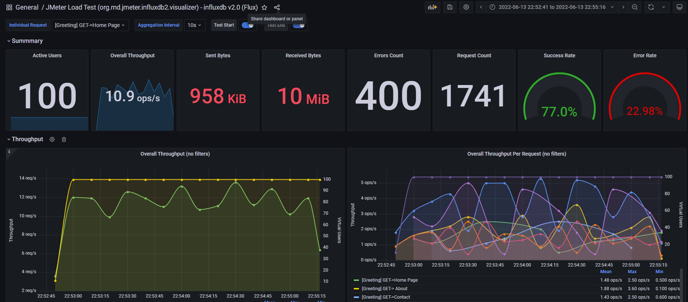

# jmeter-influxdb2-grana

Welcome! If you need to perform performance tests with **JMeter** and visualize the results in **real-time** with metrics that can truly assist you in decision-making, this solution can help you!

Here you'll find Docker containers with **InfluxDB2**, which is a database for storing **JMeter** test results, and **Grafana** for visualizing the results.

## Setup:

See full instructions on  [jmeter-influxdb2-listener-plugin](https://github.com/mderevyankoaqa/jmeter-influxdb2-listener-plugin/)  .

-   Download the  [plugin](https://github.com/mderevyankoaqa/jmeter-influxdb2-listener-plugin/releases)  **the latest release or depends on JMeter version**. The plugin “`jmeter-plugins-influxdb2-listener-<>.jar`” should be located here “`~\apache-jmeter-5.x\lib\ext`”.
-   **Make sure that you have Java 11**  or higher version - otherwise the plugin will be not displayed on UI.
-   Add Backend Listener to your test plan (Add -> Listener -> Backend Listener) and select “`io.github.mderevyankoaqa.influxdb2.visualizer.JMeterInfluxDBBackendListenerClient.`”
-   Provide in the Parameters table the InfluxDB settings, provide a name for the test, and specify which samplers to record.
-   Configure the dashboard in Grafana, execute tests, and see test results.
- Dashboard link: https://grafana.com/grafana/dashboards/13644-jmeter-load-test-org-md-jmeter-influxdb2-visualizer-influxdb-v2-0-flux